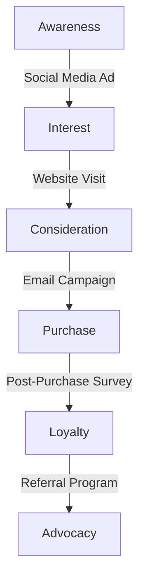

<Callout>
  The information below outlines cutting-edge data-driven marketing strategies
  for 2024. **Harnessing the power of data is no longer optional—it's essential
  for staying competitive in today's marketing landscape.**
</Callout>

In an era where consumer behavior is constantly evolving and market dynamics shift rapidly, data-driven marketing has become the cornerstone of successful campaigns. But with the sheer volume of data available, how can marketers effectively harness this information to drive results?

We often hear marketers asking:

> How can I make sense of all this data? What metrics should I prioritize? How do I balance data-driven decisions with creativity?

These are crucial questions in today's data-saturated environment, and we're here to guide you through the most effective data-driven marketing strategies for 2024.

## Key Data-Driven Marketing Strategies for 2024

Let's explore the most important data-driven techniques you should be implementing this year:

1. **Predictive Analytics**
2. **Real-Time Personalization**
3. **Customer Journey Mapping**
4. **AI-Powered Content Optimization**
5. **Multi-Touch Attribution**

### Predictive Analytics

Predictive analytics uses historical data, machine learning, and statistical algorithms to forecast future outcomes and behaviors.

```python
def predict_customer_churn(customer_data):
    model = train_churn_prediction_model(historical_data)
    churn_probability = model.predict(customer_data)
    return churn_probability
```

By anticipating customer needs and behaviors, you can proactively tailor your marketing efforts for maximum impact.

### Real-Time Personalization

Leverage data to deliver personalized experiences to your customers in real-time across various touchpoints.

<Image
  src="https://picsum.photos/seed/realtimepersonalization/800/600?grayscale"
  width="718"
  height="404"
  alt="Real-Time Personalization in Action"
/>

Real-time personalization can significantly improve engagement rates, conversions, and customer satisfaction.

### Customer Journey Mapping

Use data to create detailed maps of your customers' interactions with your brand across multiple channels and touchpoints.



A data-driven customer journey map helps you identify pain points, optimize touchpoints, and improve the overall customer experience.

### AI-Powered Content Optimization

Utilize AI and machine learning algorithms to analyze content performance and optimize future content creation.

```javascript
function optimizeContentStrategy(historicalData, contentLibrary) {
  const aiModel = trainContentOptimizationModel(historicalData);
  const optimizedStrategy = aiModel.generateStrategy(contentLibrary);
  return optimizedStrategy;
}
```

AI can help you identify the most effective content types, topics, and distribution channels for your target audience.

### Multi-Touch Attribution

Move beyond last-click attribution to understand the true impact of each marketing touchpoint on conversions.

```
Attribution Models:
1. First Touch
2. Last Touch
3. Linear
4. Time Decay
5. Position Based
6. Data-Driven (AI-powered)
```

A sophisticated multi-touch attribution model helps you allocate your marketing budget more effectively across channels and campaigns.

## Key Metrics to Track

To ensure the success of your data-driven marketing efforts, focus on these essential metrics:

- **Customer Lifetime Value (CLV)**: The total worth of a customer over the entire duration of their relationship with your business
- **Customer Acquisition Cost (CAC)**: The total cost of acquiring a new customer
- **Conversion Rate**: The percentage of visitors who take a desired action
- **Return on Ad Spend (ROAS)**: The revenue generated for every dollar spent on advertising
- **Customer Retention Rate**: The percentage of customers you retain over a given period

## Advanced Data-Driven Techniques

For those looking to take their data-driven marketing to the next level, consider these advanced strategies:

- **Propensity Modeling**: Predict the likelihood of specific customer behaviors or actions
- **Sentiment Analysis**: Use natural language processing to analyze customer sentiment across various channels
- **Prescriptive Analytics**: Move beyond predicting outcomes to recommending specific actions
- **Privacy-Preserving Analytics**: Implement techniques like federated learning to analyze data while maintaining user privacy

## Conclusion

Data-driven marketing in 2024 is about making informed decisions that drive real business results. By leveraging predictive analytics, real-time personalization, and AI-powered optimization, you can create more effective marketing campaigns that resonate with your audience and deliver measurable ROI.

What data-driven marketing challenges are you facing in 2024? Have you implemented any of these strategies in your marketing efforts? Share your experiences and questions in the comments below!
